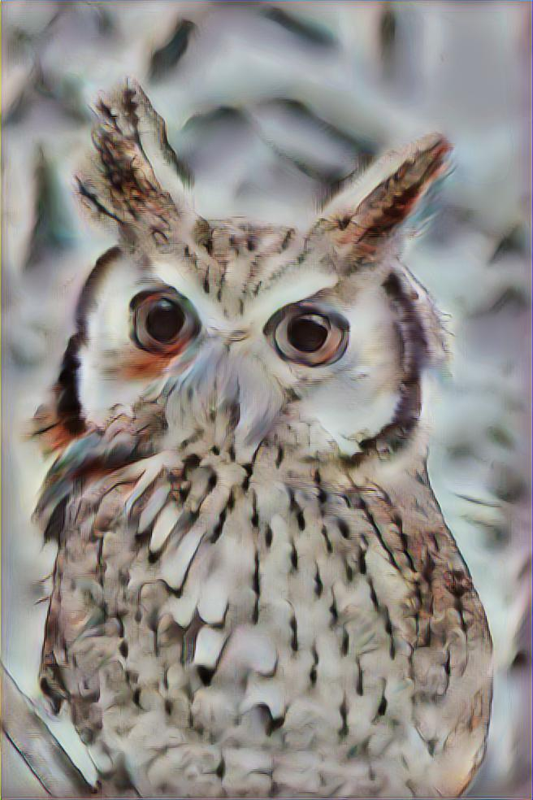
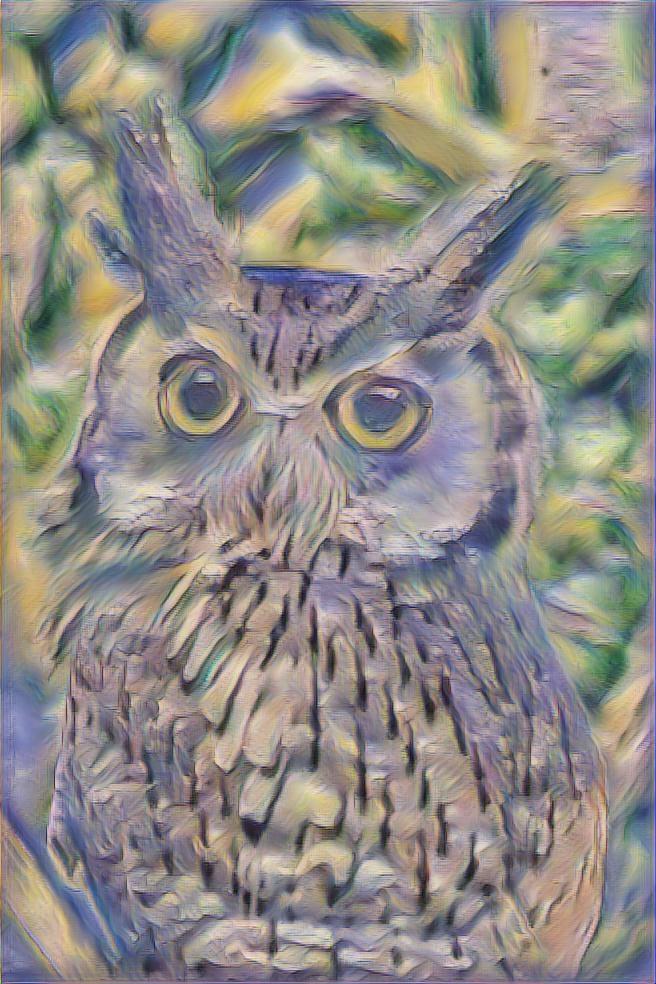
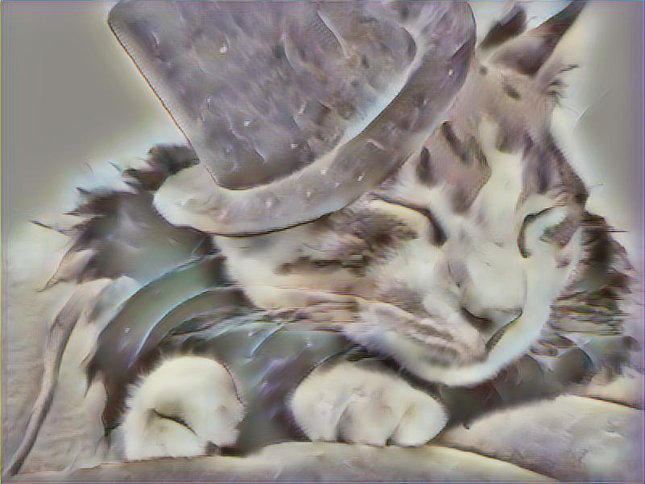
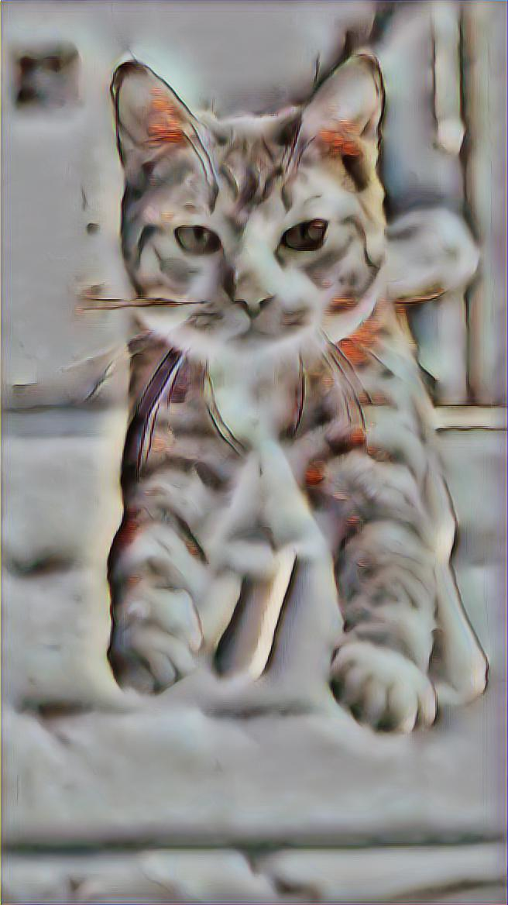
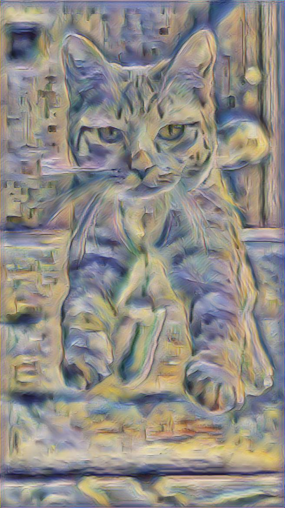
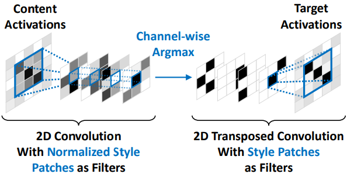

# Fast Patch-based Style Transfer of Arbitrary Style
Paper: https://arxiv.org/abs/1612.04337

## Examples
<div align='center'>
  
  
  
</div>

<div align='center'>
  
  
  
</div>

<div align='center'>
  
  
  
</div>

## Preparetion
Download [VGG16 model](http://download.tensorflow.org/models/vgg_16_2016_08_28.tar.gz) from Tensorflow Slim. Extract the file vgg_16.ckpt. Then copy it to the folder pretrained/ 

## Usage
###Stylizing images:
```
python main.py -c config/example.json -s --content images/content/*.jpg --style images/style/style_1_image_60.png
```
### Video stylization
```
python main.py -c config/example.json -s --content videos/timelapse1_orig.mp4 --style images/style/style_1_image_60.png
```


## Training an inverse network
```
python main.py -c config/example.json
```


## Style swap
Φ(.) is the function represented by a fully convolutional part of a pretrained CNN that maps an image from RGB to some intermediate activation space. So Φ(C) is the activation of content, and Φ(S) is the activation of style. 

Extract a set of patches for Φ(C) and Φ(S). The target of "Style Swap" is to find a closest-matching style patch for each content patch, and replace it. 
<div>
  
</div>
 